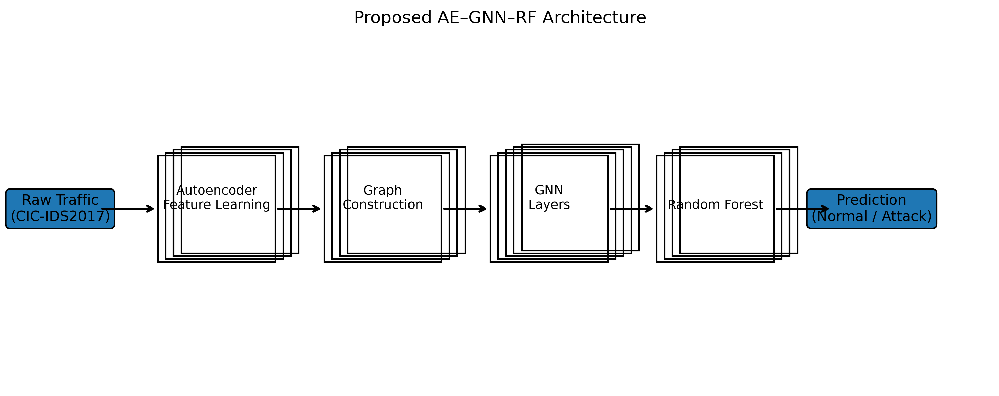

# Hybrid-AE-GNN-RF-IDS

## Overview

## Dataset
- CICIDS2017

## Methodology
1. Preprocessing
2. Graph Construction
3. Graph Neural Network
4. Autoencoder
5. Random Forest
6. Evaluation

## Architecture

## Results

| Metric | Value |
|---------|---------|
| Accuracy | XX |
| Precision | XX |
| Recall | XX |
| F1-Score | XX |

## Repository Structure

## Future Work

## Author
Raja Basfore
B.Tech CSE
Assam down town University
